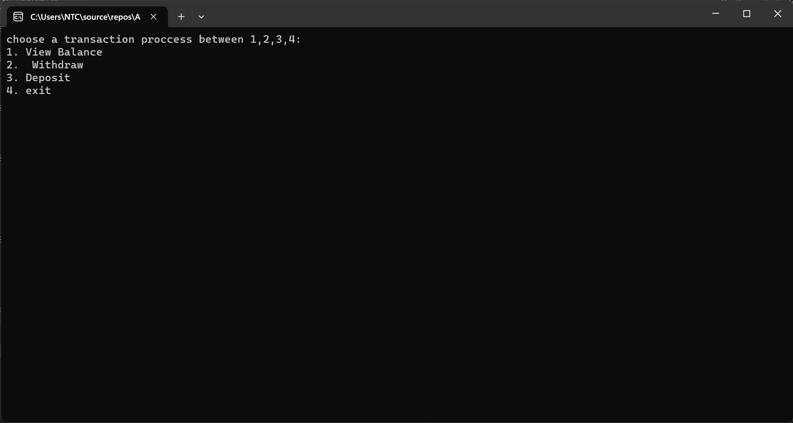
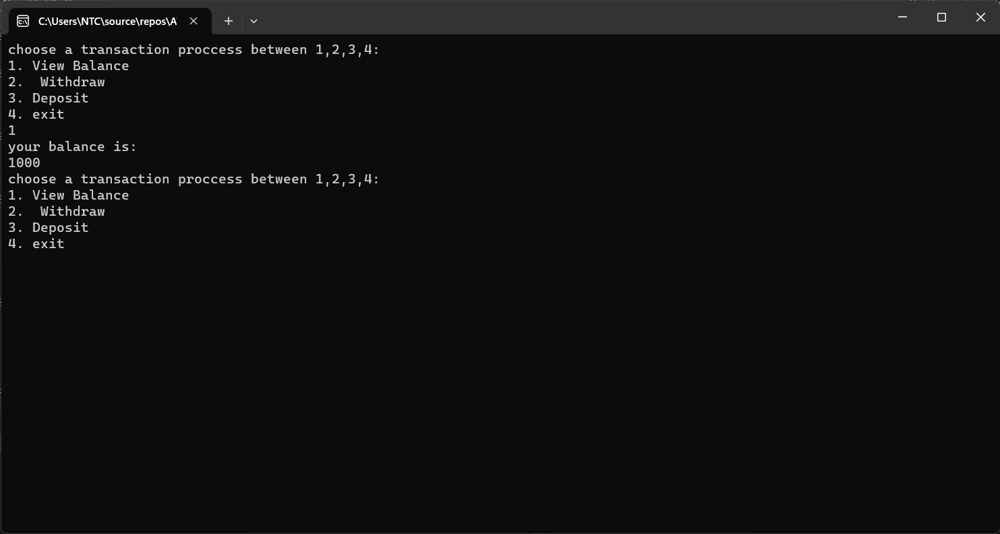
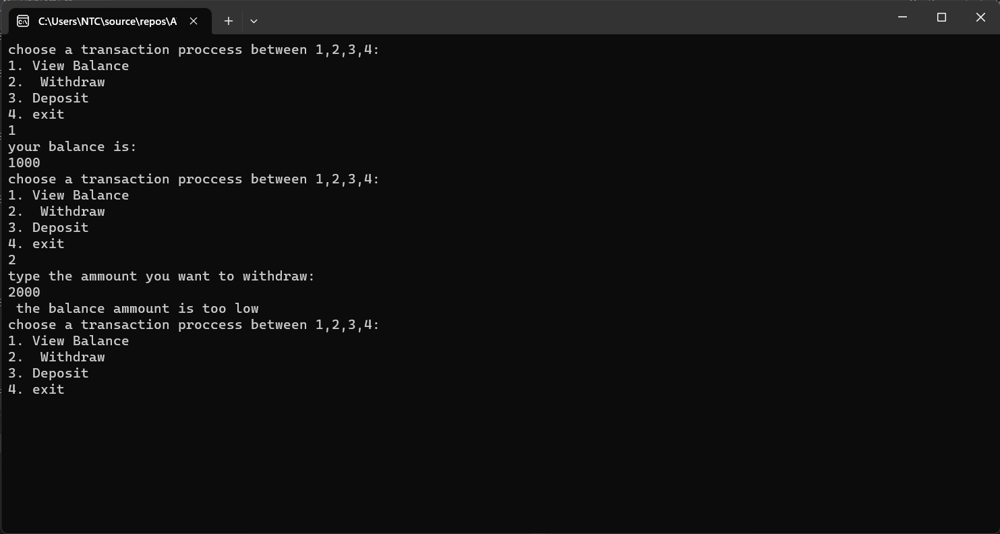
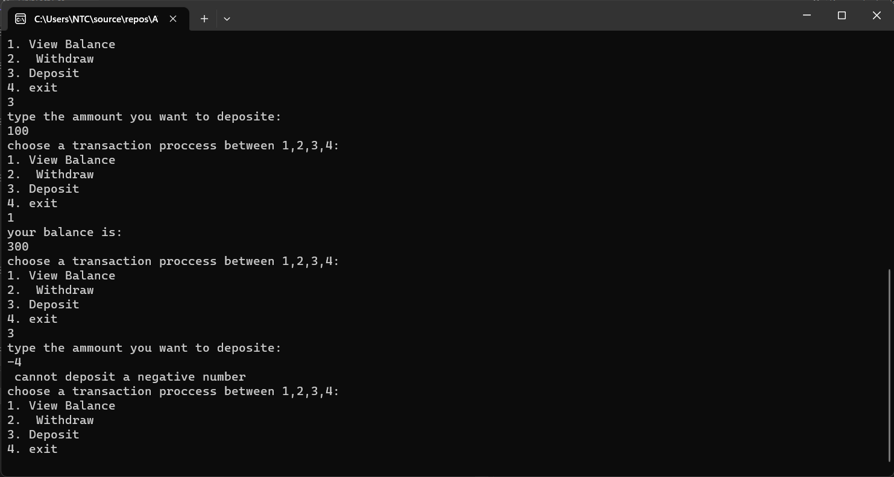
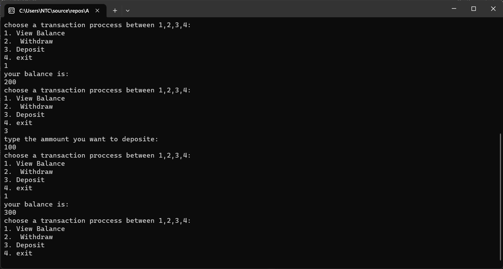
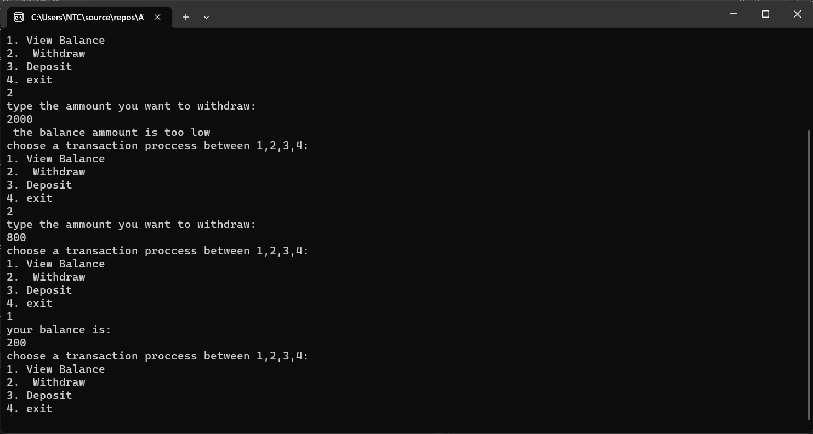
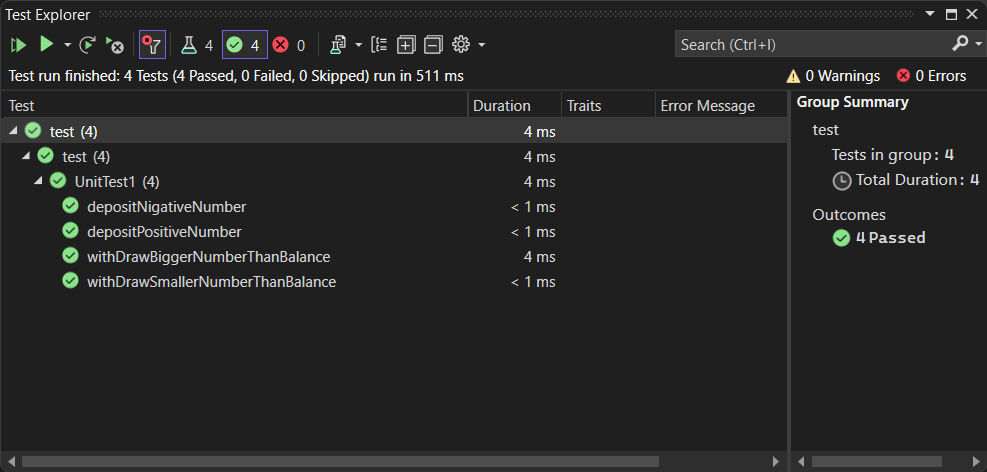

# ATM

##   Summary :

This is a simple ATM program that has multiple features as you can see your balance and deposit and withdraw form the balance.
there is some restriction for example you cant deposit a nigative number and you cant withdraw more than the balance .
this is the console for the program:

 
  

in this page you can see the transaction or exit the atm console this transaction can be tregared by the number of the transaction for example if you typed 2
you will enter the transaction of withdraw.

## here is some messages that will appear when violating the two restrections:

  

this is related to withdrawing a bigger number than the balance this will throw a massage to the user that the balance is low ofr this transaction.

this is related to depositing a negative number  than the balance this will throw a massage to the user that you cant depsit a negative number this transaction.

## here you will find the transaction that were made right :

  
  
  
## this program has been built  using xunit to help code faster as the picture below you will se the test for ever non-void method for each case and thay are valid:

  
